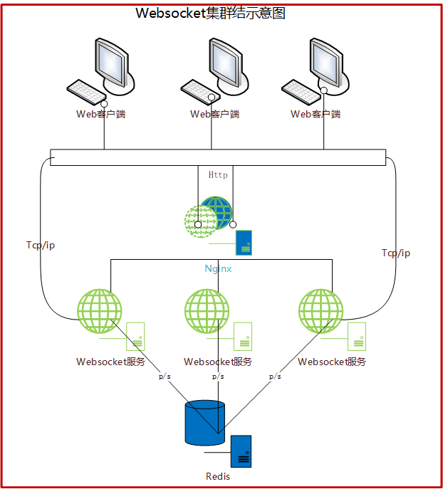

# 使用nginx+redis搭建websocket集群环境
这篇文档早在2016年就应该写了，一直拖到现在。

## 集群思路
先谈一下websocket集群的思路，具体看下图


核心：
1. 使用ngnix做反向代理
2. 使用redis p/s模式

## 环境准备
1. [准备websocket服务端代码，这里服务端我是使用javacorundumstudio.socketio实现的，里面实现的使用方式模仿了SignalR](./)
2. [客户端使用web，使用socket.io js库](./web-client)
3. 使用缓存数据库redis，主要是利用其发布订阅模式，版本v3.0.501
4. 使用nginx做反向代理，版本v1.9.15
5. 准备两台机器，操作系统都是win10

## 部署细节
1. 将业务服务分布部署在两台机器的tomacat容器中，IP为192.168.2.2，192.168.2.3，对应的配置文件如下，
```java
192.168.2.3服务对应的配置如下
websocket:
  server:
    host: 192.168.2.3
    port: 13520

redis:
  host: 192.168.2.3
  port: 6379
192.168.2.2服务对应的配置如下
websocket:
  server:
    host: 192.168.2.2
    port: 13520

redis:
  host: 192.168.2.3
  port: 6379
```
2. 在192.168.2.3上部署redis，使用其默认对外端口6379，对应的配置文件如下，
```java
bind 0.0.0.0
```

3. 在192.168.2.3上部署nginx，对应的配置文件如下，
```java
upstream  wsbackend  {
	  ip_hash;
      server   192.168.2.3:13520;
      server   192.168.2.2:13520;
	}
server {
        listen       80;
        server_name  192.168.2.3;
        location / {
			   proxy_pass    http://wsbackend;
			   proxy_connect_timeout 300s;
			   proxy_send_timeout 300s;
			   proxy_read_timeout 300s;
			   proxy_set_header X-Real-IP $remote_addr;
			   proxy_set_header Host $host;
			   proxy_set_header X-Forwarded-For $proxy_add_x_forwarded_for;
			   proxy_http_version 1.1;
			   proxy_set_header Upgrade $http_upgrade;
			   proxy_set_header Connection "upgrade";
        }
      }
```
4. web客户端配置
```js
socketioUrl: http://192.168.2.3
```

## 注意问题
1. 客户端websocket连接上后，收发消息很慢
   1. 解决方案: nginx location /配置不正确，请参考上面配置。
2. 客户端报错Gateway Time-out
   1. 解决方案: nginx location /配置不正确，请参考上面配置。
3. Java服务API获取客户端IP是nginx的IP而不是客户端真实IP
   1. 解决方案： 在nginx中proxy_set_header X-Real-IP $remote_addr;，在服务的Header中获取即可。

## 后面需要跟进
1. redis集群处理？
2. nginx集群处理？


